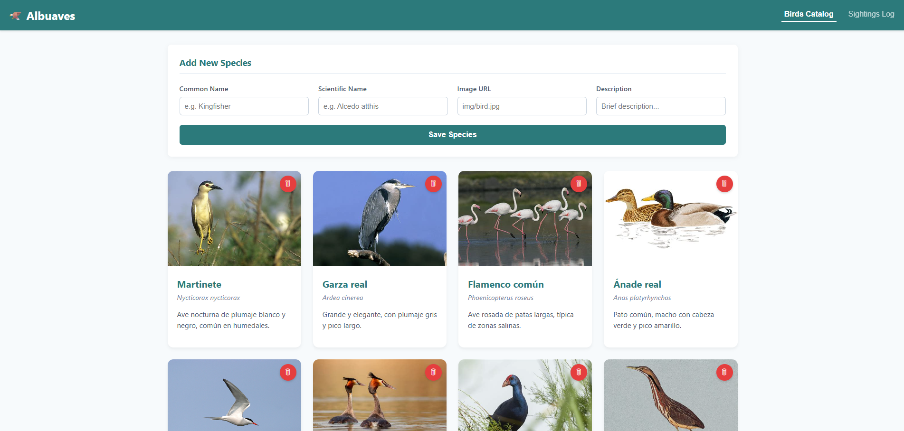
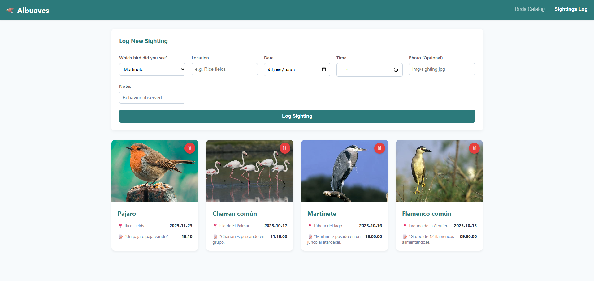

## Autor: Daniel Moret - DAM

# 🦅 Proyecto Albuaves

## 1. El código funcionando (Capturas)
Se muestran aquí las capturas del correcto funcionamiento tanto de la parte Web como la parte Java.

### A. Llamada a la API en el navegador
Cliente web mostrando la lista de avistamientos y aves cargada desde el servidor.

### B. Java ejecutándose en la terminal
Aquí se ve el cliente de escritorio (Java) conectándose a la misma API y mostrando los datos en texto.

---

## ⚙️ Requisitos Previos
Para que los scripts funcionen correctamente en su máquina, debe tener instalado:
1.  **PHP:** Disponible en el `PATH` de Windows (para ejecutar `php -S`).
2.  **Java JDK:** Kit de desarrollo de Java instalado (para `javac`).

---

## 2. Tecnologías utilizadas
Estas son las herramientas que se han elegido, sus licencias y justificación de la elección.

### 🔹 SQLite
* **Web:** [https://www.sqlite.org/](https://www.sqlite.org/)
* **Licencia:** Dominio Público (Public Domain).
* **Motivación:** Se ha elegido ser muy ligera y de facil uso sin muchos conocimientos. Al ser un solo archivo (`.db`), no es necesario instalar ni configurar servidores pesados como MySQL. Esto último facilita además mover el proyecto de un sitio a otro sin complicaciones.

### 🔹 PHP
* **Web:** [https://www.php.net/](https://www.php.net/)
* **Licencia:** PHP License.
* **Motivación:** Se he usado PHP por tener un servidor interno (`php -S`) muy cómodo para desarrollo, lo cual permite crear la API rápidamente con pocas líneas de código.

### 🔹 Java (OpenJDK)
* **Web:** [https://openjdk.org/](https://openjdk.org/)
* **Licencia:** GNU GPL v2.
* **Motivación:** Se ha creado el cliente en Java nativo (sin librerías externas) para aprender a manejar conexiones HTTP y procesamiento de texto "a mano", simplificando la compilación. Además, sea dicho, de por la familiaridad previa con el lenguaje.

### 🔹 Cliente Web (HTML5 + CSS3 + JS)
* **Estándar:** W3C.
* **Licencia:** Estándares Abiertos.
* **Motivación:** Se ha decidido no usar ningún framework (como React o Angular) y utilizar JavaScript nativo (Vanilla). Esto hace que el cliente sea extremadamente ligero y me ha permitido aprender cómo funcionan realmente las peticiones asíncronas (`fetch`) y la manipulación del DOM desde cero.

---

## 3. Tutorial: Cómo ponerlo en marcha (Scripts)
Para facilitar la corrección y el despliegue, se han creado unos scripts automáticos (`.bat`) que hacen todo el trabajo.

### Paso 1: Encender el Servidor
He preparado el script `run-api-server.bat`.

* **Qué hace:** Entra en la carpeta `php` y arranca el servidor escuchando tanto en local como en red.
* **Cómo usarlo:** Simplemente haz **doble clic** sobre el archivo. Se abrirá una ventana negra que te indicará las rutas de acceso.
* **Acceso:**
  * **Desde este PC:** `http://localhost:9191/index.html`
  * **Desde el Móvil/Red:** `http://TU_IP_LOCAL:9191/index.html` (Para saber tu IP, abre una terminal nueva y escribe el comando `ipconfig`).

### 🌐 Acceso Remoto 
Por defecto, el proyecto está configurado para funcionar en modo local (`localhost`). Si deseas acceder desde otro dispositivo (móvil, tablet) o ejecutar el cliente Java desde otro PC:

1.  **Averigua tu IP:** Ejecuta `ipconfig` en una terminal.
2.  **Cliente Web:** Accede desde el navegador del móvil a `http://TU_IP_LOCAL:9191/index.html`.
3.  **Cliente Java:** Edita el archivo `SearchBirdsAPI.java` y cambia la variable `ip` por tu dirección real antes de recompilar.

### Paso 2: Usar el Cliente Java
Para no tener que escribir comandos largos, he creado el script `java/BuscadorAvesCompiler.bat`.

* **Qué hace:** Compila el código `.java` automáticamente y, si no hay errores, lo ejecuta al momento.
* **Cómo usarlo:**
  1. Ve a la carpeta `java`.
  2. Haz **doble clic** en el archivo `BuscadorAvesCompiler.bat`.
  3. Verás el listado de aves directamente en la consola.
